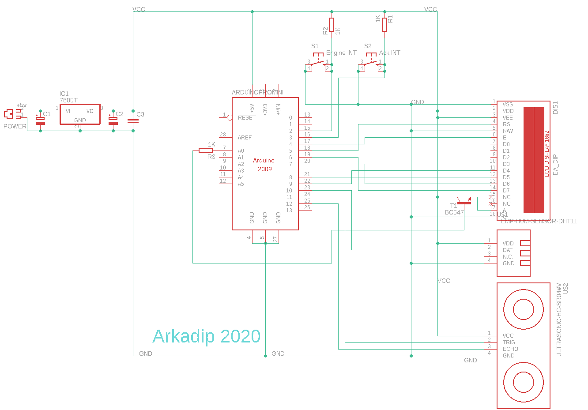

<h1>Water Lavel Indicator</h1>

> An `Arduino` based System, which uses both the power of `Hardware` and `Software` to measure the *level of water in a tank* and *current Temparature and Humidity*. It shows currrent Tank Water Volume, Water Volume Percentage, Temparature and Humidity in a ***16x2*** display.

_Images of the system_

## Inspiration

_Inspiration (to be completed)_

## Parts Used

_Parts used (to be completed)_

## Schematics

